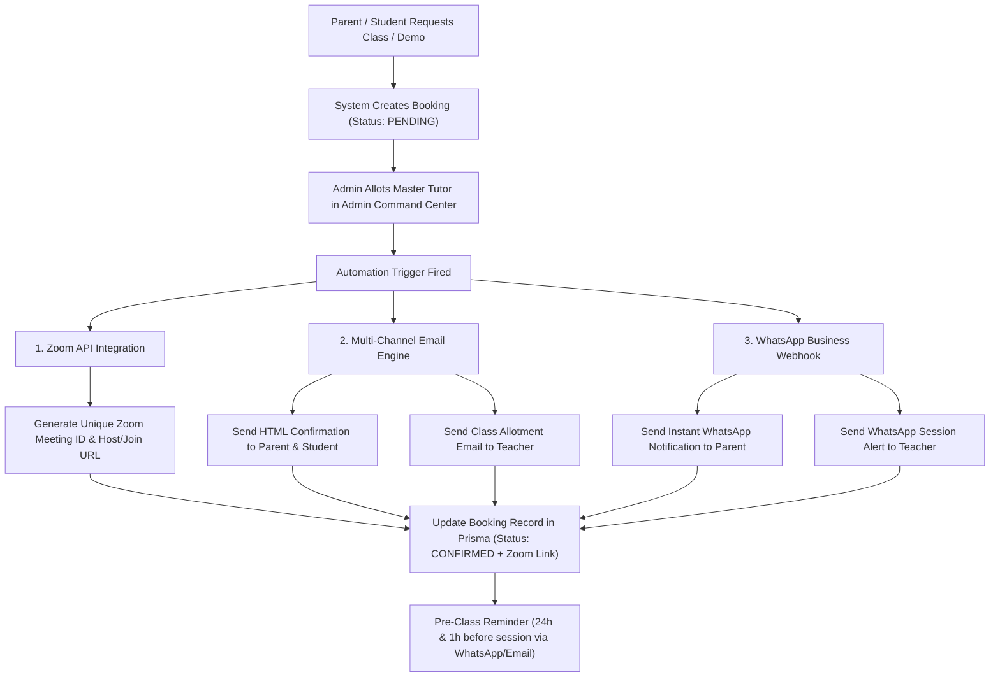

# Aevian Academy — Automated Class Scheduling & Notification Architecture

This document defines the complete end-to-end automation network for class bookings, tutor assignments, automatic video link creation, and multi-channel notifications (WhatsApp, Email, Portal).

---

## 🌐 1. High-Level Workflow Diagram



---

## 🛠️ 2. Detailed Technical Components

### Component A: Zoom API Meeting Auto-Generator
- **Service**: Zoom OAuth 2.0 Server-to-Server App Integration.
- **Trigger**: Fired automatically when `assignTeacherToBooking()` server action is invoked by Admin.
- **Payload**:
  - `topic`: `[Aevian Academy] ${courseName} - ${studentName}`
  - `type`: `2` (Scheduled Meeting)
  - `start_time`: Scheduled Date & Time (ISO 8601)
  - `duration`: `40` minutes
  - `settings`: `host_video: true`, `participant_video: true`, `auto_recording: "cloud"`
- **Response Stored**: `join_url`, `start_url`, `meeting_id`, `passcode` saved to `Booking` model in database.

### Component B: Multi-Channel Email Engine (Resend / SendGrid)
- **Email 1: Parent & Student Confirmation**
  - **Subject**: `✓ Class Confirmed: ${courseName} with ${teacherName}`
  - **Body**: Includes student name, date/time in parent's local timezone, unique Zoom join button, course syllabus breakdown, and tutor bio.
- **Email 2: Teacher Class Assignment**
  - **Subject**: `🎓 New Class Allotted: ${studentName} - ${courseName}`
  - **Body**: Includes student learning goals, grade level, Zoom host link, and lesson prep materials.

### Component C: WhatsApp Business API (Twilio / Meta Cloud API)
- **Message 1 (Parent)**:
  > *"Hello ${parentName}! 🌟 Your child ${studentName}'s class for **${courseName}** with ${teacherName} is confirmed for **${dateTime}**. Join link: ${zoomLink}. Team Aevian."*
- **Message 2 (Teacher)**:
  > *"Hello ${teacherName}! You have been allotted to teach ${studentName} for **${courseName}** on **${dateTime}**. Host link: ${zoomHostLink}."*
- **Automated Reminders**:
  - **24 Hours Before**: Sent to both parent and teacher.
  - **1 Hour Before**: Sent with direct 1-tap Zoom launch button on WhatsApp.

---

## 📌 3. Team Execution & Implementation Strategy

1. **Environment Variables Required**:
   ```env
   ZOOM_ACCOUNT_ID=your_zoom_account_id
   ZOOM_CLIENT_ID=your_zoom_client_id
   ZOOM_CLIENT_SECRET=your_zoom_client_secret
   TWILIO_ACCOUNT_SID=your_twilio_sid
   TWILIO_AUTH_TOKEN=your_twilio_auth_token
   TWILIO_WHATSAPP_NUMBER=whatsapp:+14155238886
   RESEND_API_KEY=re_123456789
   ```

2. **Database Schema Enhancements**:
   - Added `zoomJoinUrl`, `zoomStartUrl`, `zoomMeetingId`, `whatsappSent` fields to `Booking` table.
   - Added `cvUrl`, `profileCompletionPercent` fields to `TeacherProfile` table.

3. **No-Confusion Operational Guarantee**:
   - Teachers and parents do not need to configure anything manually.
   - Admin performs a single action (**"Allot Master Tutor"**), and the background network executes Zoom creation, Email dispatch, and WhatsApp notifications automatically.
